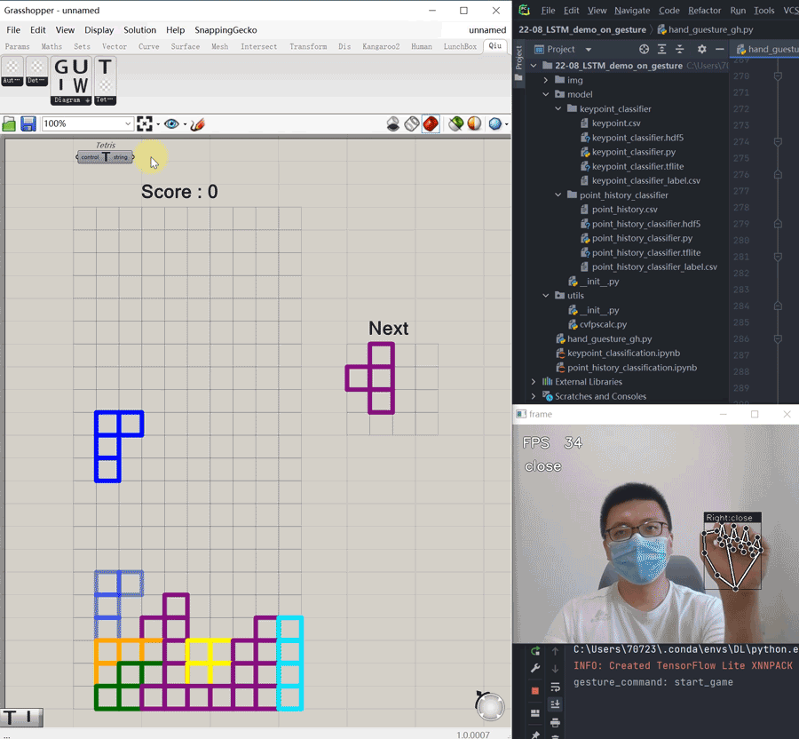

# GrasshopperTetris

## Tetris on Grasshopper!

## Setup
1. clone this project and compile or download [compiled gha file](https://github.com/LaVieon/GrasshopperTetris/releases/tag/gha)
2. Drag gha file into grasshopper canvas

## Control
You control it with keyboard.  or hand gesture.  
For keyboard:
Directions = ctrl + directions，  
End = drop block down.

## Hand gesture control
upload later

Have Fun!
